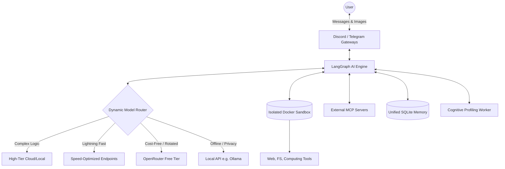

<div align="center">

# 🌌 OmniAgent 2.0

**The Ultimate Smart Multi-Agent AI Framework for Discord & Telegram**

[](https://www.python.org/downloads/)
[](https://www.docker.com/)
[](https://opensource.org/licenses/MIT)

OmniAgent is a production-grade, open-source AI assistant featuring **dynamic model routing**, **native multimodal vision**, **MCP support**, and a **persistent bulletproof Docker sandbox**.

[Features](#-enterprise-features) • [Architecture](#%EF%B8%8F-system-architecture) • [OpenRouter Prober](#-openrouter-free-tier-auto-prober) • [MCP Guide](#-extending-with-mcp) • [Contributing](CONTRIBUTING.md)

</div>

---

## ✨ Enterprise Features

### 🧠 Smart Multi-Provider Routing
Zero-latency heuristics instantly route requests to the most capable AI model for the task based on your configured fallback chain.
* **High-Tier (Complex/Math):** Routes to top-tier commercial or local models.
* **Fast-Tier (Chat/Quick):** Routes to high-speed LPU/inference providers.
* **Local Fallback:** Auto-routes to local offline engines (e.g., Ollama) if cloud providers fail or rate-limit.

### 👁️ True Native Multimodal Vision
OmniAgent intercepts Discord/Telegram media, buffers the raw bytes, and streams pixel data directly to native Vision SDKs for flawless, high-fidelity image analysis (bypassing simple URL-text scraping).

### 💾 Cross-Model Unified Memory
Powered by LangGraph and `aiosqlite`, OmniAgent maintains a continuous thread of context. You can start a conversation with one model provider, hit a rate limit, and seamlessly finish with another—without ever losing conversation context.

### 🛡️ Bulletproof Execution Sandbox
Every agent action has access to a deeply isolated, ephemeral Linux Docker container to write scripts, install `pip` packages, and execute code with strict CPU/RAM/PID resource quotas and a persistent user workspace.

### 👤 Cognitive Profiling (Background Brain)
A dedicated background daemon constantly analyzes user interactions to build a persistent, privacy-focused profile of the user's tech stack, projects, and preferences, continuously injecting this context into the system prompt.

---

## 🏗️ System Architecture

Our robust multi-agent architecture is completely provider-agnostic, allowing you to plug in any LLM ecosystem effortlessly.



---

## ⚡ OpenRouter Free Tier Auto-Prober

If you are leveraging **OpenRouter's free API tier**, you know that free models frequently go offline or hit 429 rate limits, causing annoying cascading failures.

OmniAgent solves this with a **Zero-Downtime Daemon**:
1. **Discovery:** Runs in the background (every 12 hours) and queries the OpenRouter `/models` endpoint to discover every currently available free model.
2. **Validation:** Sends a minimal 1-token probe request to each model.
3. **Hot-Swapping:** Aggressively prunes dead, removed, or rate-limited models from the active routing pool in memory.
4. **Result:** Your bot *never* attempts to query a dead free model, eliminating runtime wait times and errors.

---

## 🔌 Extending with MCP (Model Context Protocol)

OmniAgent natively supports the **Model Context Protocol (MCP)**, allowing you to attach external servers (like Google Drive, GitHub, or local filesystems) to grant the AI new capabilities without modifying core code.

### How to use MCP:
1. Open your `.env` file.
2. Define your MCP servers via the `MCP_SERVERS` JSON block.

```env
# Example MCP Configuration
MCP_SERVERS='{
  "github": {
    "command": "npx",
    "args": ["-y", "@modelcontextprotocol/server-github"]
  },
  "sqlite": {
    "command": "uvx",
    "args": ["mcp-server-sqlite", "--db-path", "/path/to/database.db"]
  }
}'
```
3. Restart OmniAgent. The agent will automatically connect to the servers on boot, dynamically extract their tools, and add them to the AI's internal tool registry!

---

## 🚀 Quickstart

### 1. Prerequisites
* **Python 3.12+** or **Docker**
* `uv` package manager (recommended for blazing fast builds)
* Platform Tokens (Discord/Telegram) and at least one LLM API Key (OpenAI, Anthropic, Gemini, Groq, OpenRouter, or Ollama URL).

### 2. Configuration
```bash
git clone https://github.com/your-repo/OmniAgent.git
cd OmniAgent
cp .env.example .env
# Edit .env with your chosen API keys
```

### 3. Deploy (Docker - Recommended)
OmniAgent uses a highly optimized, multi-stage `uv`-powered Docker build.
```bash
DOCKER_BUILDKIT=1 docker-compose up -d --build
docker-compose logs -f omniagent
```

---

## 🧰 Built-in Toolset Ecosystem
Out of the box, OmniAgent features a context-aware tool registry:
* **Sandbox Computing:** `run_sandbox_command`, `execute_python`
* **Persistent Filesystem:** `read_file`, `write_file`, `list_files`, `write_sandbox_file`
* **Long-term Memory:** `remember_note`, `recall_notes`
* **Web & Utilities:** `web_search`, `calculate`, `get_weather`, `get_current_datetime`, `fetch_url`

---

## 🤝 Contributing

We welcome contributions from the community! Whether you are adding new tool endpoints, improving the LangGraph state machine, or fixing bugs, check out our [Contributing Guide](CONTRIBUTING.md) to get started.

<div align="center">
  Released under the <b>MIT License</b>.
</div>
