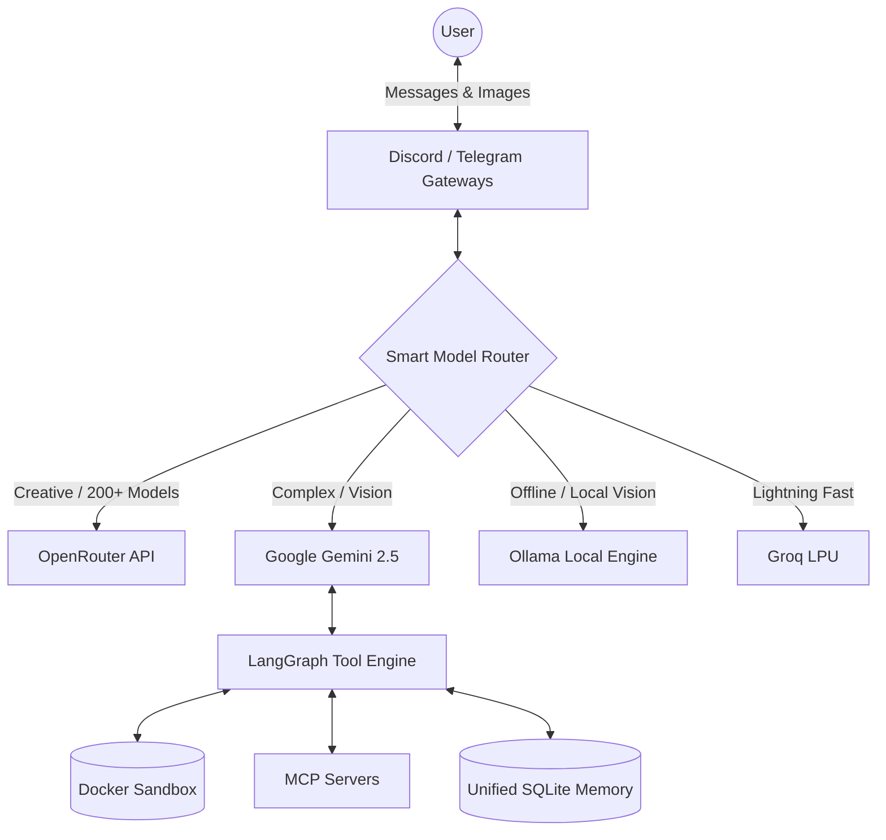

<div align="center">

# 🌌 OmniAgent 2.0

**The Ultimate Smart Multi-Agent AI Framework for Discord & Telegram**

[](https://www.python.org/downloads/)
[](https://www.docker.com/)
[](https://opensource.org/licenses/MIT)
[](#)

OmniAgent is a production-grade AI assistant featuring **zero-latency model routing**, **native multimodal vision**, and a **persistent bulletproof Docker sandbox**.

[Features](#-enterprise-features) • [Architecture](#%EF%B8%8F-system-architecture) • [Quickstart](#-quickstart) • [Contributing](#-contributing)

</div>

---

## ✨ Enterprise Features

### 🧠 Smart Multi-Provider Routing
Zero-latency heuristics instantly route requests to the most capable AI model for the task.
* **Speed:** Routes to **Groq** LPUs for instant quick replies.
* **Complex Logic & Math:** Routes to **Gemini 2.5 Pro** or **OpenAI**.
* **Local Fallback:** Auto-routes to **Ollama** (e.g., `qwen2.5-coder`) if cloud providers are offline.

### 👁️ True Native Multimodal Vision
OmniAgent doesn't just read URLs—it natively intercepts Discord/Telegram media, buffers the raw bytes, and streams pixel data directly to Vision SDKs (like `google-generativeai`) for flawless, high-fidelity image analysis.

### 💾 Cross-Model Unified Memory
Powered by LangGraph and `aiosqlite`, OmniAgent maintains a continuous thread of context. You can start a conversation with *Gemini*, switch to *Claude*, and finish with *DeepSeek*—without ever losing context.

### 🛡️ Bulletproof Execution Sandbox
Every agent gets access to a deeply isolated, ephemeral Linux Docker container to write scripts, install `pip` packages, and execute code with strict CPU/RAM/PID resource quotas and persistent user workspaces.

### 🔌 Model Context Protocol (MCP) Ready
Native support for extending your agent's capabilities dynamically. Connect external MCP servers (Google Drive, GitHub, local filesystems) without touching a single line of core code.

### ⚡ Zero-Downtime OpenRouter Daemon
A background prober fetches and validates OpenRouter's 200+ free models every 12 hours. Dead or rate-limited models are aggressively pruned from the routing pool, eliminating `404/429` cascades.

### 👤 UjjwalBrain (Continuous Profiling)
A dedicated background task constantly analyzes interactions to build a persistent profile of the owner's tech stack, projects, and preferences, seamlessly injecting this context into the system prompt.

---

## 🏗️ System Architecture



---

## 🚀 Quickstart

### 1. Prerequisites
* **Python 3.12+** or **Docker**
* `uv` package manager (recommended for blazing fast builds)
* Platform Tokens (Discord/Telegram) and at least one LLM API Key.

### 2. Configuration
```bash
git clone https://github.com/Ujjwal-Developer-5/OmniAgent.git
cd OmniAgent
cp .env.example .env
# Edit .env with your keys
```

### 3. Deploy (Docker - Recommended)
OmniAgent uses a multi-stage, `uv`-powered Docker build for sub-second dependency resolution.
```bash
DOCKER_BUILDKIT=1 docker-compose up -d --build
docker-compose logs -f omniagent
```

### 4. Local Development
```bash
uv sync
uv run python main.py
```

---

## 🧰 Built-in Toolset
The agent is equipped with a runtime-injected, context-aware tool registry:
* **Execution:** `run_sandbox_command`, `execute_python`
* **Filesystem:** `read_file`, `write_file`, `list_files`, `write_sandbox_file`
* **Memory:** `remember_note`, `recall_notes`
* **Utilities:** `web_search`, `calculate`, `get_weather`, `get_current_datetime`, `fetch_url`

---

## 🤝 Contributing

We welcome contributions from the community! OmniAgent is built to be modular and highly extensible.

### How to Contribute
1. **Fork** the repository
2. **Create a branch:** `git checkout -b feature/AmazingFeature`
3. **Commit changes:** `git commit -m 'Add some AmazingFeature'`
4. **Push:** `git push origin feature/AmazingFeature`
5. **Open a Pull Request**

### Contributors & Core Team
* **Ujjwal Kumar** - *Founder & Lead Architect* - [@Ujjwal-Developer-5](https://github.com/Ujjwal-Developer-5)

<a href="https://github.com/Ujjwal-Developer-5/OmniAgent/graphs/contributors">
  
</a>

---

<div align="center">
  Made with ❤️ by Ujjwal Kumar and Contributors.<br>
  Released under the <b>MIT License</b>.
</div>
